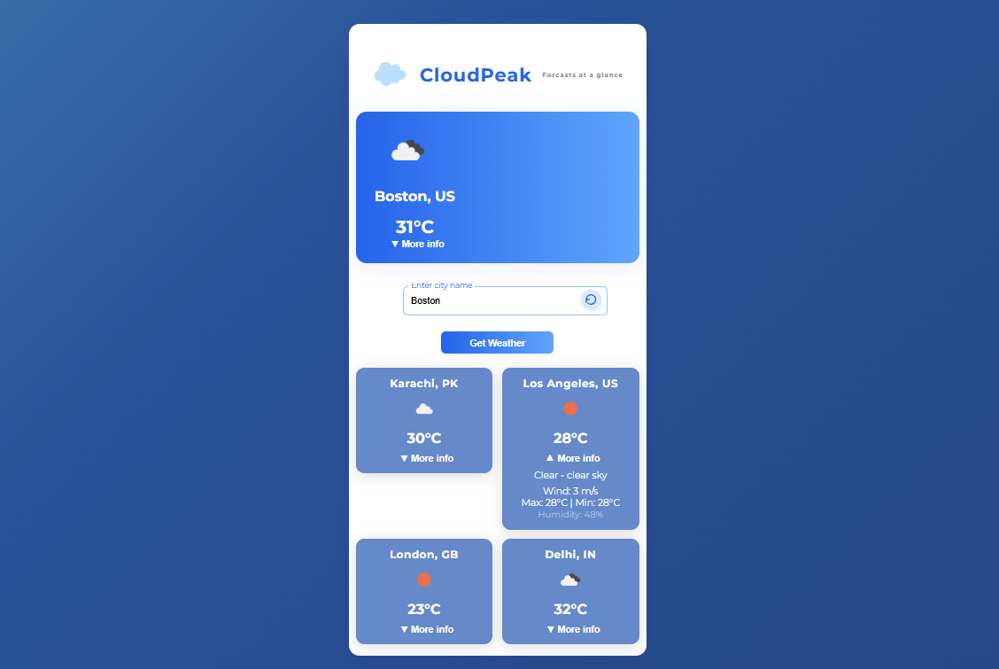

# ☁️ CloudPeak


CloudPeak is a responsive weather web application that provides real-time weather information for cities around the world. It features an animated UI, default weather cards for popular cities, a floating label search input, animated alerts, and more.

## 🚀 Features

- **Live Weather Search:** Search for any city and get current weather, humidity, wind, max/min temperature, and more.
- **Default City Cards:** Instantly view weather for Karachi, London, Delhi, and other popular cities.
- **Animated UI:** Smooth background gradients, animated cloud logo, and floating label input.
- **Responsive Design:** Looks great on desktop and mobile devices.
- **Smart Suggestions:** Get city suggestions as you type, including cities from Pakistan and neighboring countries.
- **Custom Alerts:** Smooth, animated success and error alerts for user feedback.
- **Animated Cloud Logo:** The main logo uses an animated cloud GIF for a lively touch.

## 🖼️ Preview



## 📦 Folder Structure

```
CloudPeak/
├── index.html
├── favicon.ico
├── assets/
│   ├── styles.min.css
│   ├── js/
│   │   └── app.js
├── README.md
```

## 🛠️ Getting Started

### 1. Clone the Repository

```sh
git clone https://github.com/LeviHimself/MoonCast.git
cd MoonCast
```

### 2. Install a Static Server (Optional for Local Testing)

You can use [live-server](https://www.npmjs.com/package/live-server) or [lite-server](https://www.npmjs.com/package/lite-server):

```sh
npm install -g live-server
live-server
```

Or simply open `index.html` in your browser (for most features).

### 3. Deploying to GitHub Pages

1. Ensure all files (including `index.html`) are in the root of your repository.
2. Go to your repo’s **Settings > Pages**.
3. Set the source to `main` branch and `/ (root)` folder.
4. Save and visit:  
   `https://levihimself.github.io/MoonCast/`

## 🌦️ API

This app uses the [OpenWeatherMap API](https://openweathermap.org/api).  
**You must add your own API key** in `assets/js/app.js`:

```js
const API_KEY = 'YOUR_OPENWEATHERMAP_API_KEY';
```

## ✨ Credits

- Weather data: [OpenWeatherMap](https://openweathermap.org/)
- Cloud icon: [Icons8 Cloud](https://icons8.com/icons/set/cloud)
- Animated cloud GIF: [Giphy](https://giphy.com/search/cloud)

> **Note:**  
> The OpenWeatherMap API key used in this project is exposed in the client-side code. For demo and educational purposes, this is acceptable. For production or high-traffic apps, consider using a backend proxy to keep your
